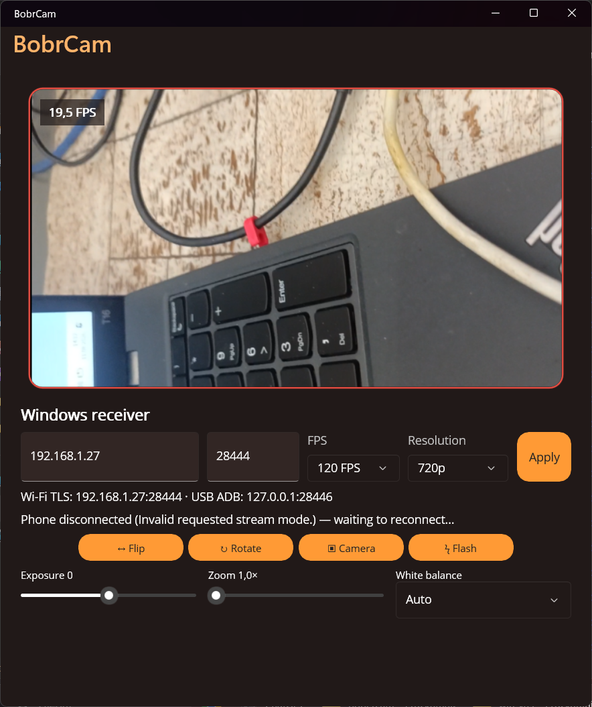
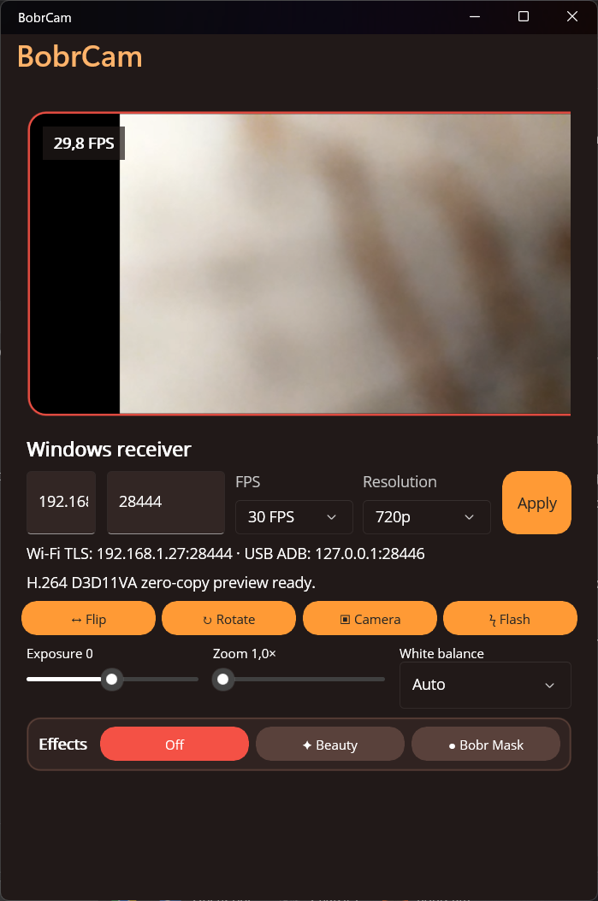

# BobrCam

**Free Webcam for OBS & PC** — turns your Android phone into a Windows webcam.

Use your phone's camera as a high-quality video source for OBS, Zoom, Teams, browsers, or the Windows Camera app. BobrCam streams authenticated H.264 over Wi-Fi or USB with low latency.

[Download the latest release](https://github.com/Boberborn/bobercam-android_webcamera/releases/latest)

## Preview

| Live receiver | Compact layout |
| --- | --- |
|  |  |

## Features

- **Full HD 60fps** camera streaming (resolves to best available resolution on your device)
- **TLS 1.2 Wi-Fi** encryption with certificate fingerprint verification
- **Wi-Fi** — auto-discovery via UDP broadcast or manual IP/port entry
- **USB (ADB)** — local-only wired transport; enable USB debugging and authorize the PC
- **Virtual camera** — appears as `BobrCam (Windows Virtual Camera)` in any app
- **Hardware H.264** — hardware encoding on Android and D3D11VA decoding on Windows
- **Flexible modes** — select resolution and frame rate based on phone capabilities
- **Camera controls** — switch cameras, rotate, mirror, flash, exposure, zoom, and white balance
- **Auto reconnect** — resumes streaming after temporary connection loss

## Requirements

- **Android phone** — any device with a camera
- **Windows 11 PC** — for the virtual camera
- **.NET 10 SDK** — for building
- **ADB** (optional) — for USB connection

## Quick Start

Download the signed Android APK and Windows installer from
[GitHub Releases](https://github.com/Boberborn/bobercam-android_webcamera/releases).

### Build

From the repository root:

```powershell
# Android
dotnet build .\BobrCam\BobrCam.csproj -f net10.0-android -m:1 -p:UseSharedCompilation=false -p:NodeReuse=false

# Windows
dotnet build .\BobrCam\BobrCam.csproj -f net10.0-windows10.0.19041.0 -m:1 -p:UseSharedCompilation=false -p:NodeReuse=false
```

### Install

1. Install the Android APK on your phone:
   ```
   adb install BobrCam\bin\Debug\net10.0-android\com.bobrcam.app-Signed.apk
   ```
2. Install the Windows virtual camera from `BobrCamVirtualCamera/`:
   ```powershell
   powershell.exe -NoProfile -ExecutionPolicy Bypass -File .\Install-BobrCamVirtualCamera.ps1 -Quiet
   ```

### Connect

**Wi-Fi:**
1. Open BobrCam on both phone and PC
2. On the phone, tap **Connect Wi-Fi** — the app auto-discovers the Windows receiver

**USB:**
```powershell
adb reverse tcp:28444 tcp:28446
```
Then tap **Connect USB** on the phone.

### Use

Once connected, `BobrCam (Windows Virtual Camera)` appears in the camera list of OBS, Zoom, Teams, browsers, and the Windows Camera app. Select it as your video source.

## Repository Layout

| Path | Purpose |
| --- | --- |
| `BobrCam/` | .NET MAUI app for Android and Windows |
| `BobrCamVirtualCamera/` | Windows 11 Media Foundation virtual camera |
| `BobrCamVirtualCamera/CameraVerifier/` | Virtual camera activation verifier |

## Security

- TLS 1.2 with per-receiver certificate pinning
- Nonce-based phone authentication prevents replaying captured handshakes
- Multiple phone identities can be remembered; new Wi-Fi phones require a 60-second pairing window
- Wi-Fi binds only to a selected private IPv4 address
- Plain USB traffic terminates only on the Windows loopback listener at `127.0.0.1:28446`
- Strict packet sizes, stream limits, timeouts, concurrent-handshake limits, and failed-authentication rate limits

Initial Wi-Fi certificate pairing uses trust on first use. Only connect on a
network you trust.

## Future charge-only USB support

The Android Open Accessory endpoint, Windows AOA activation sequence, WinUSB bulk
bridge, and KMDF upper-filter source are kept for future work. They are not enabled
in the current BobrCam release; ADB is the supported wired transport.

Build the x64 filter package with:

```powershell
powershell.exe -NoProfile -ExecutionPolicy Bypass -File `
  .\BobrCamUsbDriver\Build-BobrCamUsbFilter.ps1 -Configuration Release
```

The build compiles and links `BobrCamUsbFilter.sys`, validates the INF, and
generates an unsigned catalog under
`BobrCamUsbDriver\Filter\bin\x64\Release\`. Do not install that development
package on user machines. The catalog and driver still require Microsoft
production signing, followed by clean-machine MTP and charge-only tests.
- Certificate fingerprint advertised over UDP (not trusted without pairing)

## License

MIT
